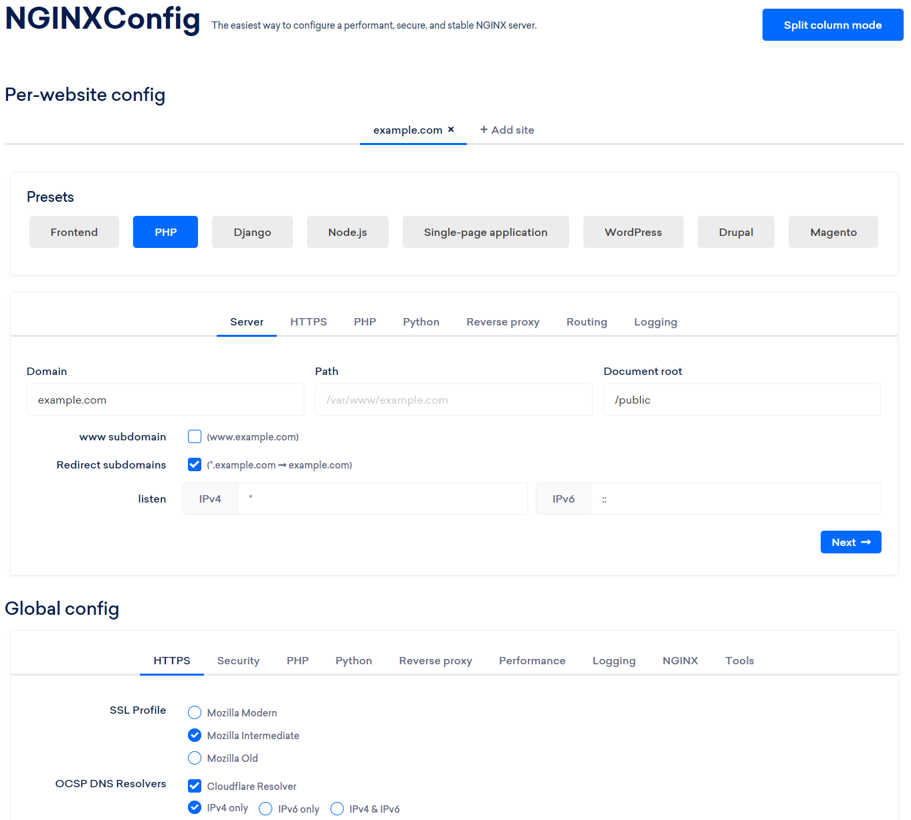

[](https://github.com/Griefed/docker-nginxconfig.io)

---

[](https://hub.docker.com/repository/docker/griefed/nginxconfig.io)
[](https://hub.docker.com/repository/docker/griefed/nginxconfig.io)
[](https://hub.docker.com/repository/docker/griefed/nginxconfig.io)
[](https://hub.docker.com/repository/docker/griefed/nginxconfig.io)
[](https://github.com/Griefed/docker-nginxconfig.io)
[](https://github.com/Griefed/docker-nginxconfig.io)

docker-nginxconfig.io

NGINX configuration generator on steroids. The only tool you will ever need to configure your NGINX server.

[](https://github.com/digitalocean/nginxconfig.io)

---

Creates a Container which runs [digitalocean's](https://github.com/digitalocean) [nginxconfig.io](https://github.com/digitalocean/nginxconfig.io), with [lsiobase/nginx](https://hub.docker.com/r/lsiobase/nginx) as the base image, as seen on https://do.co/nginxconfig.

The [lsiobase/nginx](https://hub.docker.com/r/lsiobase/nginx) image is a custom base image built with [Alpine linux](https://alpinelinux.org/) and [S6 overlay](https://github.com/just-containers/s6-overlay).
Using this image allows us to use the same user/group ids in the container as on the host, making file transfers much easier

## Deployment

### Pre-built images

```docker-compose.yml
version: '3.6'
services:
  nginxconfig.io:
    container_name: nginxconfig.io
    image: griefed/nginxconfig.io
    restart: unless-stopped
    volumes:
      - ./path/to/config:/config
    environment:
      - TZ=Europe/Berlin
      - PUID=1000  # User ID
      - PGID=1000  # Group ID
    ports:
      - 80:80
      - 443:443
```

## Raspberry Pi

To run this container on a Raspberry Pi, use the `arm`-tag. I've tested it on a Raspberry Pi 3B.

`griefed/nginxconfig.io:arm`

## Configuration

Configuration | Explanation
------------ | -------------
[Restart policy](https://docs.docker.com/compose/compose-file/#restart) | "no", always, on-failure, unless-stopped
config volume | Contains config files and logs.
data volume | Contains your/the containers important data.
TZ | Timezone
PUID | for UserID
PGID | for GroupID
ports | The port where the service will be available at.

## User / Group Identifiers

When using volumes, permissions issues can arise between the host OS and the container. [Linuxserver.io](https://www.linuxserver.io/) avoids this issue by allowing you to specify the user `PUID` and group `PGID`.

Ensure any volume directories on the host are owned by the same user you specify and any permissions issues will vanish like magic.

In this instance `PUID=1000` and `PGID=1000`, to find yours use `id user` as below:

```
  $ id username
    uid=1000(dockeruser) gid=1000(dockergroup) groups=1000(dockergroup)
```

### Building the image yourself

Use the [Dockerfile](https://github.com/Griefed/docker-nginxconfig.io/Dockerfile) to build the image yourself, in case you want to make any changes to it

#### docker-compose.yml

```docker-compose.yml
version: '3.6'
services:
  nginxconfig.io:
    container_name: nginxconfig.io
    build: ./docker-nginxconfig.io/
    restart: unless-stopped
    volumes:
      - ./path/to/config/files:/config
    environment:
      - TZ=Europe/Berlin
      - PUID=1000  # User ID
      - PGID=1000  # Group ID
    ports:
      - 8080:80
      - 443:443
```

1. Clone the repository: `git clone https://github.com/Griefed/docker-nginxconfig.io.git ./docker-nginxconfig.io`
1. Prepare docker-compose.yml file as seen above
1. `docker-compose up -d --build nginxconfig.io`
1. Visit IP.ADDRESS.OF.HOST:8080
1. ???
1. Profit!
